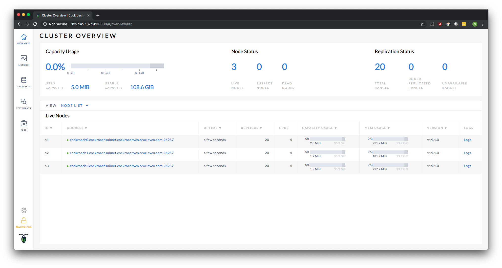

# terraform-oci-arch-cockroachdb

This is a Terraform code that deploys [CockroachDB](https://www.cockroachlabs.com/) on [Oracle Cloud Infrastructure (OCI)](https://cloud.oracle.com/en_US/cloud-infrastructure). It is developed jointly by Oracle and Cockroach Labs.

This reference architecture shows a typical three-node deployment of CockroachDB on Oracle Cloud Infrastructure Compute instances. A public load balancer is used to distribute the workloads across these three nodes.

For details of the architecture, see [_Deploy a highly available CockroachDB cluster_](https://docs.oracle.com/en/solutions/ha-cockroachdb-cluster)

## Prerequisites

- Permission to `manage` the following types of resources in your Oracle Cloud Infrastructure tenancy: `vcns`, `internet-gateways`, `route-tables`, `security-lists`, `subnets`, and `instances`.

- Quota to create the following resources: 1 VCN, 1 subnet, 1 Internet Gateway, 1 route rules, 1 Load Balancer, and 3 CockroachDB compute instances.

If you don't have the required permissions and quota, contact your tenancy administrator. See [Policy Reference](https://docs.cloud.oracle.com/en-us/iaas/Content/Identity/Reference/policyreference.htm), [Service Limits](https://docs.cloud.oracle.com/en-us/iaas/Content/General/Concepts/servicelimits.htm), [Compartment Quotas](https://docs.cloud.oracle.com/iaas/Content/General/Concepts/resourcequotas.htm).

## Deploy Using Oracle Resource Manager

1. Click [](https://cloud.oracle.com/resourcemanager/stacks/create?region=home&zipUrl=https://github.com/oracle-devrel/terraform-oci-arch-cockroachdb/releases/latest/download/terraform-oci-arch-cockroachdb-stack-latest.zip)

    If you aren't already signed in, when prompted, enter the tenancy and user credentials.

2. Review and accept the terms and conditions.

3. Select the region where you want to deploy the stack.

4. Follow the on-screen prompts and instructions to create the stack.

5. After creating the stack, click **Terraform Actions**, and select **Plan**.

6. Wait for the job to be completed, and review the plan.

    To make any changes, return to the Stack Details page, click **Edit Stack**, and make the required changes. Then, run the **Plan** action again.

7. If no further changes are necessary, return to the Stack Details page, click **Terraform Actions**, and select **Apply**. 

## Deploy Using the Terraform CLI

### Clone the Module
Now, you'll want a local copy of this repo. You can make that with the commands:

    git clone https://github.com/oracle-devrel/terraform-oci-arch-cockroachdb
    cd terraform-oci-arch-cockroachdb
    ls

### Prerequisites
First off, you'll need to do some pre-deploy setup.  That's all detailed [here](https://github.com/cloud-partners/oci-prerequisites).

Secondly, create a `terraform.tfvars` file and populate with the following information:

```
# Authentication
tenancy_ocid         = "<tenancy_ocid>"
user_ocid            = "<user_ocid>"
fingerprint          = "<finger_print>"
private_key_path     = "<pem_private_key_path>"

# Region
region = "<oci_region>"

# availability Domain 
availability_domain_name = "<availability_domain_name>" # for example GrCH:US-ASHBURN-AD-1

# Compartment
compartment_ocid        = "<compartment_ocid>"

```

### Create the Resources
Run the following commands:

    terraform init
    terraform plan
    terraform apply

### Verify the Deployment
Copy loadbalancer_public_url output and verify the access with your web browser.  
**Note:** if you don't see the cluster overview screen available immediately, please wait for a couple of minutes. We have observed an occasional short delay in being able to see the page up and running.




### Destroy the Deployment
When you no longer need the deployment, you can run this command to destroy the resources:

    terraform destroy

## Architecture Diagram


## Attribution & Credits
Initially, this project was created and distributed in [GitHub Oracle QuickStart space](https://github.com/oracle-quickstart). For that reason, we would like to thank all the involved contributors enlisted below:
- Oguz Pastirmaci (https://github.com/OguzPastirmaci)
- Lukasz Feldman (https://github.com/lfeldman)
- Ben Lackey (https://github.com/benofben)

## License
Copyright (c) 2024 Oracle and/or its affiliates.

Licensed under the Universal Permissive License (UPL), Version 1.0.

See [LICENSE](LICENSE) for more details.
